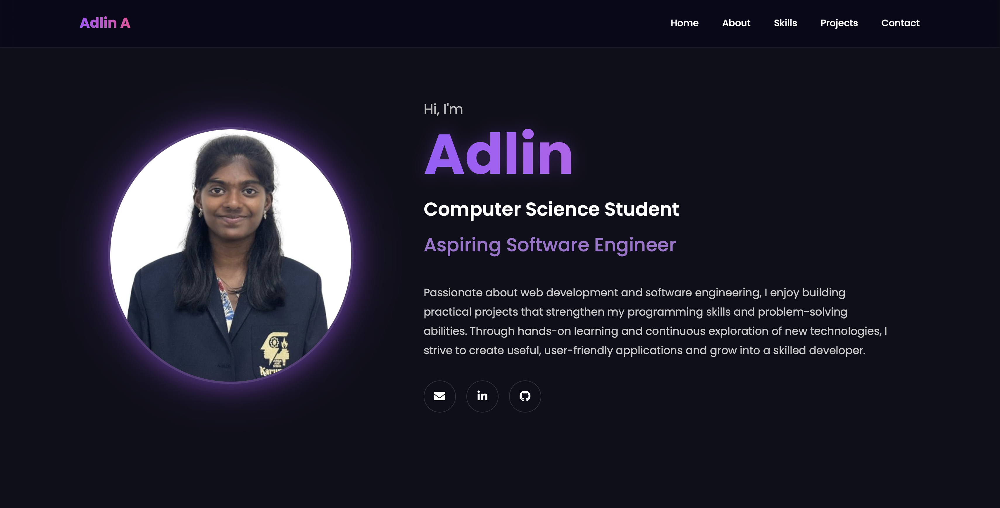
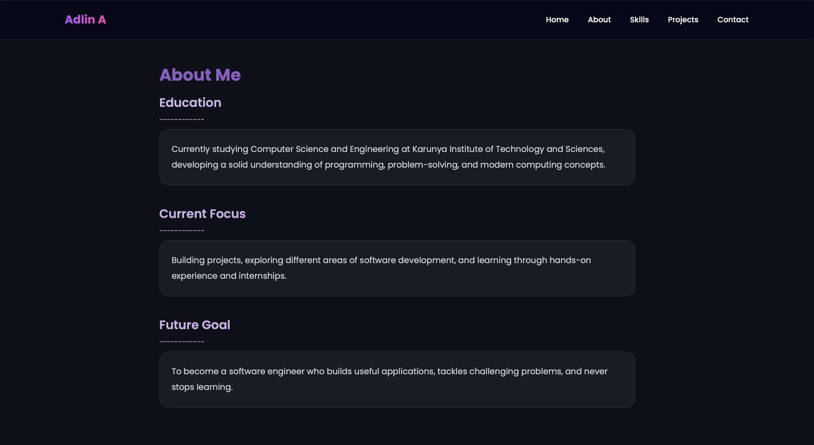
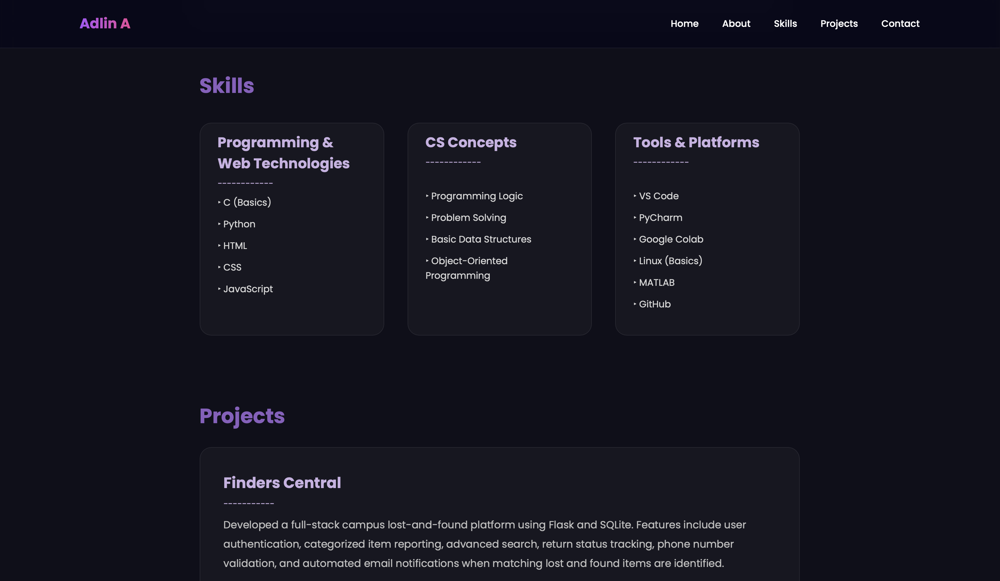
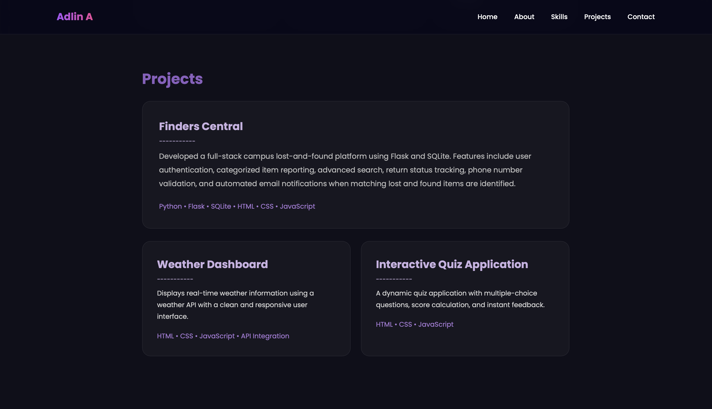
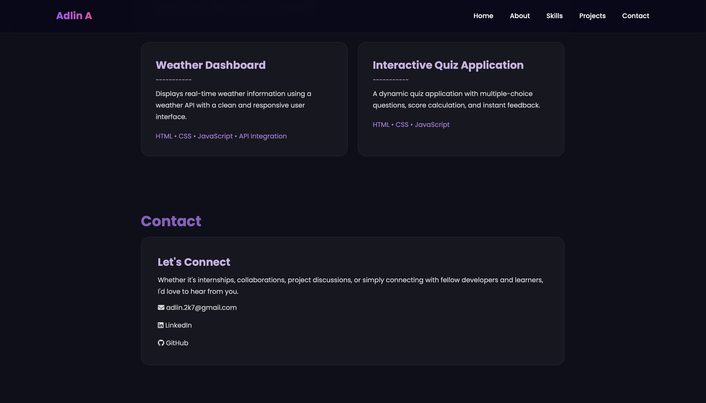
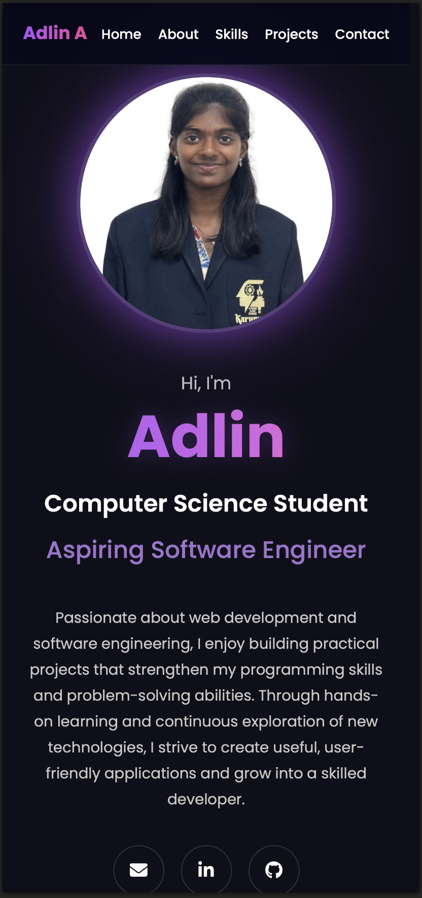

# Personal Portfolio Website
🌐 **Live Demo:** [Open Portfolio](https://adlin1307.github.io/Portfolio-Website/)

---

## Intern Details

- **Name:** Adlin A
- **Intern ID:** CITS3666
- **Organization:** Codtech IT Solutions Pvt. Ltd.
- **Domain:** Frontend Web Development
- **Duration:** 4 Weeks

## Project Name

Personal Portfolio Website

## Project Scope

This project is a responsive personal portfolio website developed using HTML and CSS. The website showcases personal information, educational background, technical skills, projects, and contact details in a professional and visually appealing format.

## Technologies Used

- HTML5
- CSS3
- Responsive Web Design

## Features

- Responsive design for desktop and mobile devices
- About Me section
- Skills section
- Projects showcase
- Contact section
- Smooth navigation
- Professional portfolio layout

## Project Structure

```text
Portfolio-Website/
│
├── documentation/
│   └── Portfolio_Documentation.pdf
│
├── images/
│   └── Adlin.jpeg
│
├── screenshots/
│   ├── Home.png
│   ├── About.png
│   ├── Skills.png
│   ├── Projects.png
│   ├── Contact.png
│   └── Mobile-view.png
│
├── index.html
├── style.css
└── README.md
```

## Screenshots

### Home Page


### About Section


### Skills Section


### Projects Section


### Contact Section


### Mobile View


## Documentation

The repository includes project documentation containing the project overview, technologies used, features, scope, and future enhancements.<br>
[View Documentation](documentation/Portfolio_Documentation.pdf)

## Future Enhancements

- Add JavaScript animations
- Add downloadable resume
- Add additional projects